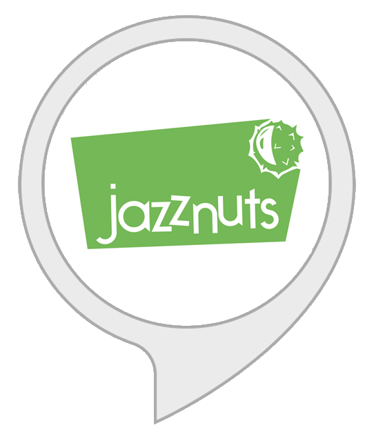

# "Meine Jazznuts" Alexa skill

*Meine Jazznuts* is a German-speaking [Alexa](https://en.wikipedia.org/wiki/Amazon_Echo) skill, which informs you about upcoming and past concerts of the [Jazznuts](http://www.jazznuts.de). The Jazznuts is an a cappella choir at the [University of Regensburg](https://www.uni-regensburg.de).

### Example Conversation
1. *Alexa, öffne "Meine Jazznuts"*
2. *Wann findet das nächste Konzert statt?*
3. *Wie lange ist noch bis zum nächsten Konzert?*
4. *Was ist das Thema des nächsten Konzerts*
5. *Wo findet das nächste Konzert statt?*
6. *Kann man Karten für das Konzert reservieren?*
7. *Was war der Titel des letzten Konzertes?*
8. *Welche Lieder wurden im letzten Konzert gesungen?*
9. *Was war das Konzerttitel im Wintersemester 2017?*
10. *Erzähle mir über die Jazznuts.*

## Interaction Model

### Intents
|Name|Sample Utterance|
|---|---|
|`NextConcertDateIntent`|*Wann findet das nächste Konzert statt?*|
|`NextConcertTitleIntent`|*Was ist das Thema des nächsten Konzerts*|
|`NextConcertLocationIntent`|*Wo findet das nächste Konzert statt?*|
|`NextConcertPriceIntent`|*Wieviel Eintritt kostet das nächste Konzert?*|
|`ReservationInfoIntent`|*Kann man Karten für das Konzert reservieren?*|
|`PastSemestersTitleIntent`|*Was war das Konzerttitel im Wintersemester 2017?*|
|`BuyTicketsInfoIntent`|*Wo kann man Tickets kaufen?*|
|`ReducedPriceInfoIntent`|*Wer bekommt einen ermäßtigen Preis?*|
|`TimeUntilNextConcertIntent`|*Wie lange ist noch bis zum nächsten Konzert?*|
|`ListPastSemestersTitlesIntent`|*Was waren die Themen in den letzten Semestern?*|
|`LastConcertTitleIntent`|*Was war der Titel des letzten Konzertes?*|
|`LastConcertSongListIntent`|*Welche Lieder wurden im letzten Konzert gesungen?*|
|`PastSemestersSongListIntent`|*Welche Lieder wurden im Konzert im Sommer 2016 gesungen?*|
|`AboutIntent`|*Erzähle mir über die Jazznuts.*|

### Slot types
|Name|Values|
|---|---|
|`Semester`|`Sommersemester`, `Sommer`, `Wintersemester`, `Winter`|

## Endpoint
The endpoint is a [Node.js](https://nodejs.org) [AWS Lambda](https://aws.amazon.com/lambda/) function using the Alexa Skills Kit SDK for Node.js [`ask-sdk`](https://github.com/alexa/alexa-skills-kit-sdk-for-nodejs).

Check out the lambda function in [`/lambda/custom`](./lambda/custom).
